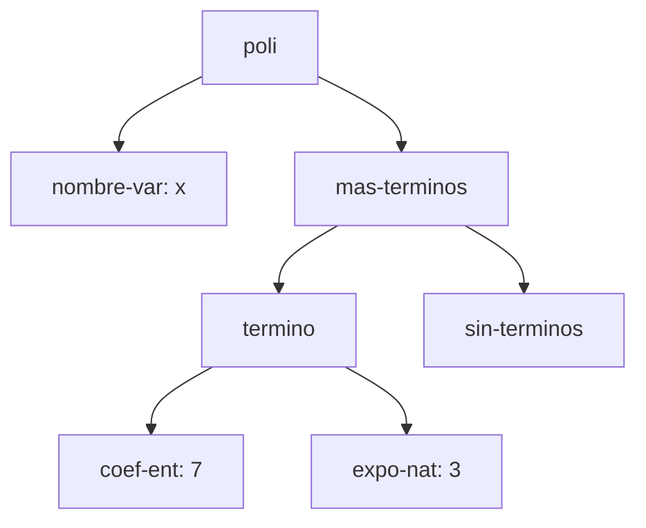
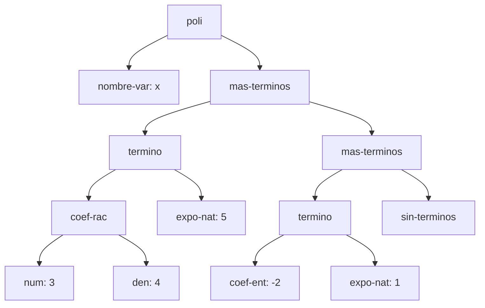
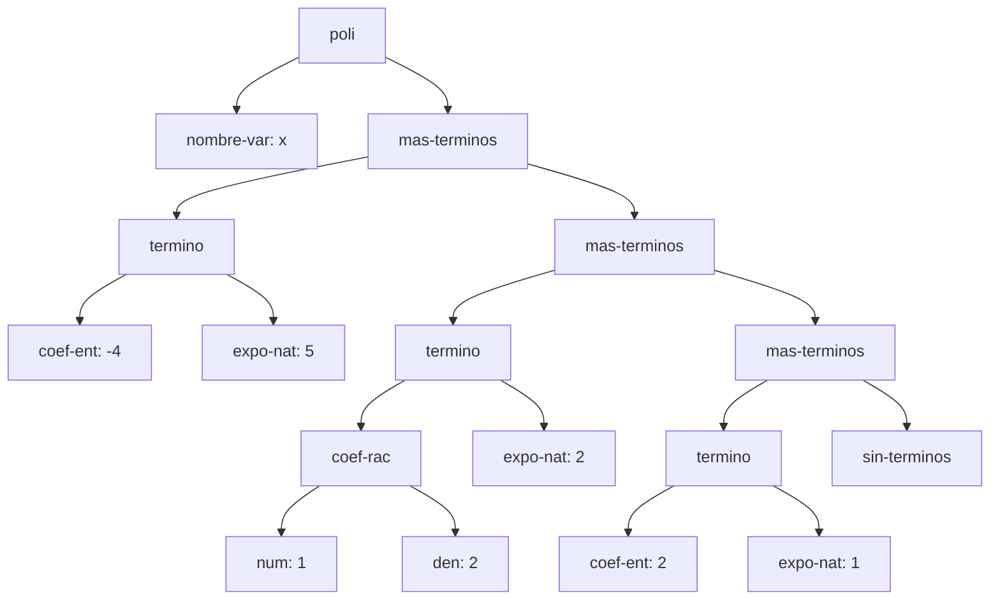
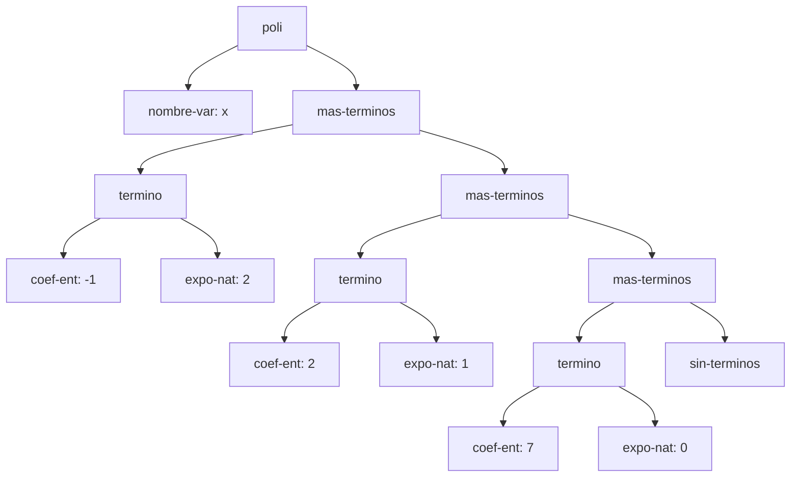

# Informe de AST — Taller 1: polinomios dispersos

**Curso:** Fundamentos de Interpretación y Compilación de Lenguajes
de Programación — Universidad del Valle, Sede Tuluá.

**Integrantes del grupo:**

| Nombre | Código | Correo institucional |
|--------|--------|----------------------|
| Andres Felipe Quiceno Gil | 2477362 | quiceno.andres@correounivalle.edu.co |
| Yonier Alejandro Vega Rojas | 2477056 | yonier.vega@correounivalle.edu.co |
| Jhon Fabricio Hurtado Marin | 2459472 | hurtado.jhoan@correounivalle.edu.co|
| Juan Esteban Aguirre Castañeda | 2459676 | juan.esteban.aguirre@correounivalle.edu.co |

---

## 1. Gramática considerada

```bnf
<polinomio>   ::= <variable> <terminos>
                   poli(var, terms)

<variable>    ::= <symbol>
                   nombre-var(s)

<terminos>    ::= '()
                   sin-terminos()
              ::= <termino> <terminos>
                   mas-terminos(term, resto)

<termino>     ::= <coeficiente> <exponente>
                   termino(coef, expo)

<coeficiente> ::= <int>
                   coef-ent(n)
              ::= <int> "/" <int>
                   coef-rac(num, den)

<exponente>   ::= <int>
                   expo-nat(k)
```

Realización de cada no terminal con `define-datatype`:

| No terminal | Variantes del datatype | Campos |
|---|---|---|
| `<polinomio>` | `poli` | `var` (variable), `terms` (terminos) |
| `<variable>` | `nombre-var` | `s` (símbolo) |
| `<terminos>` | `sin-terminos`, `mas-terminos` | `sin-terminos` no tiene campos; `mas-terminos` tiene `term` (termino-tad) y `resto` (terminos) |
| `<termino>` | `termino` | `coef` (coeficiente), `expo` (exponente) |
| `<coeficiente>` | `coef-ent`, `coef-rac` | `coef-ent`: `n`; `coef-rac`: `num`, `den` |
| `<exponente>` | `expo-nat` | `k` |

El tipo de `<termino>` se llama `termino-tad`, porque `define-datatype` no
permite que el nombre del tipo coincida con el de su variante.

---

## 2. Ejemplos de AST

### Ejemplo 1 — un solo término con coeficiente entero

**Polinomio:** $p_1 = 7x^{3}$

**Construcción:**

```scheme
(poli (nombre-var 'x)
      (mas-terminos (termino (coef-ent 7) (expo-nat 3))
                    (sin-terminos)))
```

**AST:**



**Explicación:** el nodo `nombre-var` guarda la variable `x` y es el primer
hijo de `poli`. El segundo hijo es la lista de términos: un `mas-terminos`
con el único término y, como resto, `sin-terminos`, que cierra la lista y es
el caso base de la recursión. El coeficiente y el exponente son nodos
separados porque la gramática los define como categorías distintas
(`<coeficiente>` y `<exponente>`), cada una con sus propias variantes.

---

### Ejemplo 2 — dos términos, uno con coeficiente racional

**Polinomio:** $p_2 = \frac{3}{4}x^{5} - 2x$

**Construcción:**

```scheme
(poli (nombre-var 'x)
      (mas-terminos (termino (coef-rac 3 4) (expo-nat 5))
        (mas-terminos (termino (coef-ent -2) (expo-nat 1))
                      (sin-terminos))))
```

**AST:**



**Explicación:** el subárbol de `coef-rac` tiene dos hijos, numerador y
denominador, mientras que `coef-ent` tiene uno solo, el entero. Los términos
aparecen de arriba hacia abajo con exponentes 5 y 1: el orden estrictamente
decreciente que exige el invariante se lee siguiendo la cadena de
`mas-terminos` desde la raíz.

---

### Ejemplo 3 — tres o más términos, con término independiente

**Polinomio:** $p_3 = 4x^{5} - \frac{3}{2}x^{2} + 7$

**Construcción:**

```scheme
(poli (nombre-var 'x)
      (mas-terminos (termino (coef-ent 4) (expo-nat 5))
        (mas-terminos (termino (coef-rac -3 2) (expo-nat 2))
          (mas-terminos (termino (coef-ent 7) (expo-nat 0))
                        (sin-terminos)))))
```

**AST:**


**Explicación:** el término independiente $7$ es un `termino` como los demás,
con `coef-ent: 7` y exponente 0. Su exponente sigue siendo un nodo `expo-nat`
porque la gramática no tiene un caso especial para las constantes: un
término independiente es $7x^0$, y así el recorrido recursivo de las
funciones no necesita tratarlo aparte.

---

### Ejemplo 4 — el resultado de `(sumar p q)`

**Operandos:**

- $p = 4x^{5} - \frac{3}{2}x^{2} + 7$ (el AST es el del Ejemplo 3)
- $q = -4x^{5} + \frac{1}{2}x^{2} + 2x$

**Resultado:** $p + q = -x^{2} + 2x + 7$

**AST de `q`:**



**AST del resultado:**



**Origen de cada nodo.** `sumar` recorre las dos listas en paralelo y compara
el exponente de la cabeza de cada una:

| Término del resultado | Viene de | Observación |
|---|---|---|
| $-x^{2}$ (`coef-ent: -1`, `expo-nat: 2`) | suma de ambos | $-\frac{3}{2} + \frac{1}{2} = -1$. Es un nodo nuevo, y como el resultado es entero el constructor pasa de `coef-rac` a `coef-ent`. |
| $2x$ (`coef-ent: 2`, `expo-nat: 1`) | $q$ | El exponente 1 solo está en $q$, así que el término pasa igual. |
| $7$ (`coef-ent: 7`, `expo-nat: 0`) | $p$ | El exponente 0 solo está en $p$, así que el término pasa igual. |

**Términos cancelados:** los términos de exponente 5, $4x^5$ de $p$ y
$-4x^5$ de $q$. Sus coeficientes suman $4 + (-4) = 0$. El invariante exige
que ningún término tenga coeficiente cero, por eso no aparece ningún nodo de
exponente 5 en el resultado. Las dos listas avanzan a sus restos y la
recursión sigue con los términos de exponente 2.

---

## 3. Referencias

- Friedman, D. P., & Wand, M. *Essentials of Programming Languages*,
  3.ª ed., MIT Press, 2008. Sección 2.1 (especificación de datos),
  sección 2.2 (representaciones de un TAD), sección 2.4
  (`define-datatype` y `cases`).
- Documentación de Mermaid y de GitHub para diagramas y fórmulas en Markdown.
