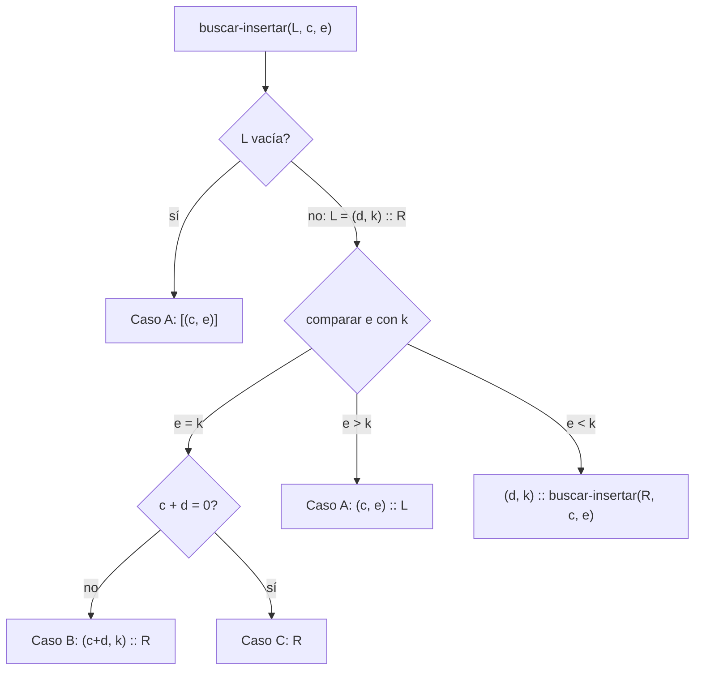

# Informe de corrección — Taller 1: polinomios dispersos

**Curso:** Fundamentos de Interpretación y Compilación de Lenguajes
de Programación — Universidad del Valle, Sede Tuluá.

**Integrantes del grupo:**

| Nombre | Código | Correo institucional |
|--------|--------|----------------------|
| Andres Felipe Quiceno Gil | 2477362 | {{correo}} |
| Yonier Alejandro Vega Rojas | 2477056 | {{correo}} |
| Jhon Fabricio Hurtado Marin | 2459472 | hurtado.jhoan@correounivalle.edu.co |
| Juan Esteban Aguirre Castañeda | 2459676 | juan.esteban.aguirre@correounivalle.edu.co |

---

## 1. Marco formal

### 1.1 Corrección de programas recursivos

Sea $f : A \to B$ una función y $A$ un conjunto definido
recursivamente. Sea $P_f$ un programa recursivo en Racket que pretende
calcular $f$. Decimos que $P_f$ es correcto con respecto a su
especificación si se cumple:

$$
\forall a \in A \,:\, P_f(a) = f(a)
$$

La estrategia de demostración es **inducción estructural** sobre $A$.
Aquí $A$ es el conjunto de listas de términos que genera la gramática:

- **Caso base:** $a = \text{sin-terminos}()$, y se verifica
  $P_f(a) = f(a)$ directamente.
- **Caso inductivo:** $a = \text{mas-terminos}(t, r)$. Se asume la
  **hipótesis de inducción** $P_f(r) = f(r)$ sobre el resto de la
  lista y se demuestra $P_f(a) = f(a)$.

Las tres funciones auxiliares que se analizan (`buscar-coeficiente`,
`buscar-eliminar` y `buscar-insertar`) están escritas con recursión
estructural sobre la lista de términos, sin acumuladores. Por eso la
corrección se demuestra con hipótesis de inducción y no con una
invariante de acumulador.

**Convenciones.**

- Escribimos una lista de términos como $L = [t_1, \ldots, t_n]$ con
  $t_i = (c_i, e_i)$. La lista vacía $[\,]$ es `sin-terminos`, y
  $t :: R$ es `mas-terminos(t, R)`.
- $\mathrm{exps}(L) = \{e_1, \ldots, e_n\}$ es el conjunto de
  exponentes de $L$.
- Un `eopl:error` **aborta** toda la computación: si una llamada
  recursiva levanta un error, la función que la invocó también lo
  levanta. Lo escribimos $\bot$ (error).
- $|L|$ es el número de términos de $L$.

### 1.2 El invariante de la representación

Las cuatro condiciones del enunciado se enuncian como una única
propiedad sobre polinomios. Sea $p$ un polinomio con términos
$t_1, t_2, \ldots, t_n$, donde $t_i = (c_i, e_i)$:

$$
\mathrm{Inv}(p) \equiv
\underbrace{\forall i < n : e_i > e_{i+1}}_{\text{orden estricto}}
\ \land\
\underbrace{\forall i : c_i \neq 0}_{\text{sin ceros}}
\ \land\
\underbrace{\forall i : e_i \in \mathbb{N}}_{\text{exponentes naturales}}
\ \land\
\underbrace{\forall i : \mathrm{red}(c_i)}_{\text{racionales reducidos}}
$$

donde $\mathrm{red}\left(\frac{a}{b}\right)$ abrevia
$b > 0 \,\land\, \mathrm{mcd}(|a|, b) = 1$, y un coeficiente entero se
toma como el racional de denominador $1$.

Como la propiedad solo habla de la lista de términos, escribimos
$\mathrm{Inv}(L)$ para una lista de términos y $\mathrm{Inv}(p)$ para
$\mathrm{Inv}(\mathrm{terminos}(p))$. Las cuatro condiciones se pueden
verificar término por término: tres de ellas (sin ceros, exponentes
naturales y racionales reducidos) hablan de **un** término a la vez, y
solo el orden estricto habla de **pares consecutivos**.

### 1.3 Hechos auxiliares

Estos hechos se usan en todas las demostraciones.

**Hecho F1 (cola).** Si $\mathrm{Inv}(t :: R)$ con $t = (c, k)$,
entonces $\mathrm{Inv}(R)$ y todo exponente de $R$ es menor que $k$.

*Demostración.* Las condiciones de ceros, naturales y reducidos son
universales sobre los términos, así que valen para los de $R$. El orden
estricto entre pares consecutivos de $R$ es un subconjunto de los pares
de $t :: R$. Además $k = e_1 > e_2 > \cdots > e_n$, y por transitividad
de $>$ todo exponente de $R$ es menor que $k$. $\square$

**Hecho F2 (unicidad de exponentes).** Si $\mathrm{Inv}(L)$, los
exponentes de $L$ son distintos dos a dos. Por tanto, para cada $e$
hay **a lo sumo un** término de $L$ con exponente $e$.

*Demostración.* Una sucesión estrictamente decreciente no repite
valores. $\square$

**Hecho F3 (subsucesión).** Si $\mathrm{Inv}(L)$ y $L'$ se obtiene de
$L$ borrando un término, entonces $\mathrm{Inv}(L')$.

*Demostración.* Las tres condiciones por término se conservan porque
$L'$ solo tiene términos de $L$. Para el orden: dos términos
consecutivos de $L'$ eran términos de $L$ con exponentes $e_i$ y $e_j$
con $i < j$ (a lo sumo separados por el término borrado). Como
$e_i > \cdots > e_j$, por transitividad $e_i > e_j$. $\square$

**Hecho F4 (traducción de coeficientes).** Sea $x$ un racional exacto
de Racket. Entonces:

1. `coef-concreto->abstracto` construye `coef-ent(x)` si $x$ es
   entero, y `coef-rac(numerator(x), denominator(x))` en otro caso.
2. El coeficiente abstracto resultante cumple $\mathrm{red}$, porque
   `numerator` y `denominator` de Racket devuelven la forma reducida
   con denominador positivo.
3. `coef-abstracto->concreto` es la inversa:
   $\mathrm{concreto}(\mathrm{abstracto}(x)) = x$, ya que
   $\frac{\texttt{numerator}(x)}{\texttt{denominator}(x)} = x$.
4. La suma de dos racionales exactos es un racional exacto.

Este hecho es el que sostiene la cuarta condición del invariante en
`insertar-termino`.

---

## 2. Funciones analizadas

En el código del grupo cada función pública valida primero sus
argumentos y luego delega la recursión en una función auxiliar
(`buscar-coeficiente`, `buscar-eliminar`, `buscar-insertar`). Por eso
cada demostración tiene dos partes: la validación (pre-condición) y la
inducción sobre la lista de términos en la auxiliar.

### 2.1 Corrección de `coeficiente-de`

**Especificación.**

- **Tipo:** `coeficiente-de : polinomio × exponente -> coeficiente`
- **Pre-condición:** $\mathrm{Inv}(p)$ y $e$ es un entero exacto con
  $e \geq 0$. Si $e$ no cumple esto, la función levanta
  `eopl:error` antes de recorrer la lista (esto lo hace la validación
  de la función pública).
- **Post-condición:** $\text{Post}(p, e, r) \equiv
  \exists i : e_i = e \ \land\ r = c_i$ cuando el exponente $e$
  aparece en $p$; y la función levanta `eopl:error` cuando no aparece.
  Por F2 el término $i$ es único, así que $r$ está bien definido.

**Código.**

```racket
;; coeficiente-de : polinomio x exponente -> coeficiente concreto
;; Propósito: validar el exponente y delegar la búsqueda.
(define coeficiente-de
  (lambda (polinomio exponente)
    (cond
      [(not (and (integer? exponente) (exact? exponente) (>= exponente 0)))
       (eopl:error 'coeficiente-de "Lo siento: el exponente debe ser un entero no negativo")]
      [else (buscar-coeficiente (poli->terms polinomio) exponente)])))

;; buscar-coeficiente : terminos x exponente -> coeficiente concreto
;; Propósito: recorrer los términos y devolver el coeficiente del que
;; tiene el exponente buscado; error si no existe.
(define buscar-coeficiente
  (lambda (terms expo)
    (cond
      [(sin-terminos? terms)
       (eopl:error 'buscar-coeficiente "Lo siento: el polinomio no tiene termino con ese exponente ingresado")]
      [else
       (let* ([term (mas-terminos->term terms)]
              [resto (mas-terminos->resto terms)]
              [expt (termino->expo term)])
         (cond
           [(= (expo-nat->k expt) expo)
            (coef-abstracto->concreto (termino->coef term))]
           [(> expo (expo-nat->k expt))
            (eopl:error 'buscar-coeficiente "Lo siento: el polinomio no tiene termino con ese exponente ingresado")]
           [else (buscar-coeficiente resto expo)]))])))
```

**Lo que se demuestra.** Sea $B(L, e)$ el resultado de
`buscar-coeficiente` sobre la lista $L$ y el exponente $e$. Se prueba
por inducción estructural sobre $L$ la siguiente propiedad
$\mathcal{P}(L)$:

$$
\mathrm{Inv}(L) \Rightarrow
\Big(\, e \in \mathrm{exps}(L) \Rightarrow B(L, e) = c_i \text{ con } e_i = e \,\Big)
\ \land\
\Big(\, e \notin \mathrm{exps}(L) \Rightarrow B(L, e) = \bot \,\Big)
$$

**Demostración.**

- **Caso base** ($L = [\,]$, `sin-terminos`): el conjunto
  $\mathrm{exps}([\,])$ es vacío, así que $e \notin \mathrm{exps}(L)$.
  El programa entra por la primera rama del `cond` y levanta
  `eopl:error`, o sea $B([\,], e) = \bot$. Es exactamente lo que pide la
  propiedad.

  $$
  \mathrm{exps}([\,]) = \emptyset \ \Rightarrow\ e \notin \mathrm{exps}([\,])
  \ \land\ B([\,], e) = \bot
  $$

- **Caso inductivo** ($L = (c, k) :: R$ con $\mathrm{Inv}(L)$): por F1,
  $\mathrm{Inv}(R)$ y todo exponente de $R$ es menor que $k$. Se asume
  como hipótesis de inducción $\mathcal{P}(R)$. Se distinguen tres
  subcasos según la comparación de $e$ con $k$:

  1. **$k = e$.** El programa toma la primera rama y devuelve
     `coef-abstracto->concreto(c)`, que es $c$ por F4. Como
     $e = k \in \mathrm{exps}(L)$, la propiedad exige devolver
     el coeficiente del término de exponente $e$, que es $c$ (único
     por F2). ✓

  2. **$e > k$.** El programa levanta error sin mirar $R$. Hay que
     probar que en este caso $e \notin \mathrm{exps}(L)$:
     $e \neq k$ porque $e > k$, y todo exponente de $R$ es menor que
     $k$, luego menor que $e$. Entonces $e$ no aparece ni en la
     cabeza ni en el resto, y el error es el resultado correcto. ✓

     Este es el subcaso en el que el **orden estricto** permite cortar
     la búsqueda: como los exponentes decrecen, si $e$ ya es mayor que
     el de la cabeza, no puede estar más adelante.

  3. **$e < k$.** El programa devuelve $B(R, e)$, usando la hipótesis
     de inducción. Como $e \neq k$,
     $e \in \mathrm{exps}(L) \iff e \in \mathrm{exps}(R)$, y los
     términos de $R$ son términos de $L$. Por $\mathcal{P}(R)$:
     si $e \in \mathrm{exps}(R)$, $B(R, e)$ es el coeficiente
     buscado; si no, $B(R, e) = \bot$. En ambos casos coincide con lo
     que pide $\mathcal{P}(L)$. ✓

  Los tres subcasos cubren todas las posibilidades de comparar dos
  enteros ($=$, $>$, $<$), por lo que $\mathcal{P}(L)$ vale.

- **Levantamiento del error.** Del análisis anterior, el error se
  levanta en exactamente dos lugares: el caso base y el subcaso
  $e > k$. En ambos se probó que $e \notin \mathrm{exps}(L)$. Recíprocamente,
  si $e \notin \mathrm{exps}(L)$, la propiedad $\mathcal{P}(L)$ dice que
  el resultado es $\bot$. Por tanto **el error se levanta si y solo si
  el exponente no aparece**. El error por exponente inválido (negativo o
  inexacto) lo levanta la validación de `coeficiente-de` antes de llamar
  a `buscar-coeficiente`, y es un caso aparte, ya excluido por la
  pre-condición.

- **Terminación.** La medida es $|L|$, el número de términos de la lista
  de entrada. En el caso base no hay llamada recursiva. En el subcaso
  $e < k$ la llamada es sobre $R$, con $|R| = |L| - 1 < |L|$. Los otros
  dos subcasos no hacen llamada recursiva. Como $|L| \in \mathbb{N}$ y
  decrece estrictamente en cada llamada, con cota inferior $0$ (la lista
  vacía, que no recursa), la función termina. Además cada llamada
  recursiva se hace sobre una sola sublista, así que se recorre la lista
  **una sola vez**.

**Conclusión:** para todo polinomio $p$ que cumple $\mathrm{Inv}(p)$ y
todo exponente $e$ natural exacto, `coeficiente-de` devuelve el
coeficiente del término de exponente $e$ cuando existe y levanta error
cuando no existe. Además termina.

---

### 2.2 Corrección de `eliminar-termino`

**Especificación.**

- **Tipo:** `eliminar-termino : polinomio × exponente -> polinomio`
- **Pre-condición:** $\mathrm{Inv}(p)$ y $e$ es un entero exacto con
  $e \geq 0$ (en otro caso la validación levanta error).
- **Post-condición:** el resultado contiene **exactamente** los
  términos de $p$ menos el de exponente $e$. Formalmente:
  $$
  \text{terminos}(r) = \text{terminos}(p) \setminus \{(c_i, e) \mid e_i = e\}
  $$
  y la función levanta `eopl:error` si $e$ no aparece en $p$. Además el
  resultado conserva la variable de $p$ y cumple $\mathrm{Inv}(r)$.

**Código.**

```racket
;; eliminar-termino : polinomio x exponente -> polinomio
;; Propósito: validar el exponente y devolver un polinomio sin el término.
(define eliminar-termino
  (lambda (polinomio exponente)
    (cond
      [(not (and (integer? exponente) (exact? exponente) (>= exponente 0)))
       (eopl:error 'eliminar-termino "Lo siento: el exponente debe ser un entero no negativo")]
      [else
       (poli (poli->var polinomio)
             (buscar-eliminar (poli->terms polinomio) exponente))])))

;; buscar-eliminar : terminos x exponente -> terminos
;; Propósito: devolver los términos sin el de exponente dado; error si no existe.
(define buscar-eliminar
  (lambda (terms expo)
    (cond
      [(sin-terminos? terms)
       (eopl:error 'buscar-eliminar "Lo siento: el polinomio no tiene termino con ese exponente ingresado por lo tanto no podemos eliminar termino")]
      [else
       (let* ([term (mas-terminos->term terms)]
              [resto (mas-terminos->resto terms)]
              [expt (termino->expo term)])
         (cond
           [(= (expo-nat->k expt) expo) resto]
           [(> expo (expo-nat->k expt))
            (eopl:error 'buscar-eliminar "Lo siento: el polinomio no tiene termino con ese exponente ingresado por lo tanto no podemos eliminar termino")]
           [else (mas-terminos term (buscar-eliminar resto expo))]))])))
```

**Demostración.** Sea $E(L, e)$ el resultado de `buscar-eliminar`. Se
prueba por inducción estructural sobre $L$ la propiedad
$\mathcal{Q}(L)$:

$$
\mathrm{Inv}(L) \Rightarrow
\Big(\, e \in \mathrm{exps}(L) \Rightarrow
E(L, e) = L' \text{ con } \mathrm{terminos}(L') = \mathrm{terminos}(L) \setminus \{(c_i, e)\} \,\Big)
\ \land\
\Big(\, e \notin \mathrm{exps}(L) \Rightarrow E(L, e) = \bot \,\Big)
$$

- **Caso base** ($L = [\,]$): $e \notin \mathrm{exps}(L)$ y el programa
  levanta error. ✓

- **Caso inductivo** ($L = (c, k) :: R$, con $\mathrm{Inv}(L)$): por F1,
  $\mathrm{Inv}(R)$ y los exponentes de $R$ son menores que $k$.
  Hipótesis de inducción: $\mathcal{Q}(R)$.

  1. **$k = e$.** El programa devuelve $R$. Por F2 el único término de
     $L$ con exponente $e$ es $(c, k)$, así que
     $\mathrm{terminos}(R) = \mathrm{terminos}(L) \setminus \{(c, e)\}$. ✓

  2. **$e > k$.** Igual que en 2.1: $e \notin \mathrm{exps}(L)$, y el
     programa levanta error. ✓

  3. **$e < k$.** El programa devuelve $(c, k) :: E(R, e)$.
     - Si $e \in \mathrm{exps}(R)$, por $\mathcal{Q}(R)$ se tiene
       $E(R, e) = R'$ con
       $\mathrm{terminos}(R') = \mathrm{terminos}(R) \setminus \{(c_j, e)\}$.
       Entonces los términos del resultado son
       $\{(c, k)\} \cup \big(\mathrm{terminos}(R) \setminus \{(c_j, e)\}\big)$.
       Como $k \neq e$, el término $(c, k)$ no es el eliminado, y esto
       es igual a $\mathrm{terminos}(L) \setminus \{(c_j, e)\}$. ✓
     - Si $e \notin \mathrm{exps}(R)$, como $e \neq k$ tampoco está en
       $L$, y por $\mathcal{Q}(R)$ el error de la llamada recursiva se
       propaga, que es lo que pide la propiedad. ✓

- **El resultado sigue cumpliendo $\mathrm{Inv}$.** La lista devuelta
  se obtiene de $L$ borrando un único término, así que por F3
  $\mathrm{Inv}$ se conserva: quitar un término no rompe el orden
  estricto (se conserva por transitividad) ni introduce ceros, porque no
  se crea ningún término nuevo. La función pública envuelve el resultado
  con la misma variable de $p$, así que la variable también se conserva.

- **Terminación.** La medida es $|L|$. El único subcaso con llamada
  recursiva es $e < k$, sobre $R$ con $|R| = |L| - 1$. Con cota inferior
  $0$ en la lista vacía, la función termina, y recorre la lista una sola
  vez.

**Conclusión:** `eliminar-termino` devuelve exactamente los términos de
$p$ sin el de exponente $e$ cuando existe, levanta error cuando no
existe, conserva el invariante y termina.

---

### 2.3 `insertar-termino` preserva el invariante

**Enunciado.** Si $\mathrm{Inv}(p)$ vale antes de la llamada, entonces
$\mathrm{Inv}(\texttt{insertar-termino}(p, c, e))$ vale sobre el
resultado, siempre que la llamada devuelva un resultado (si los
argumentos son inválidos, la función levanta error y no devuelve ningún
polinomio, así que no hay nada que preservar).

**Código.**

```racket
;; insertar-termino : polinomio x coeficiente x exponente -> polinomio
;; Propósito: validar, descartar coeficientes cero y delegar la inserción.
(define insertar-termino
  (lambda (polinomio coeficiente exponente)
    (cond
      [(not (and (number? coeficiente) (exact? coeficiente)))
       (eopl:error 'insertar-termino "Lo siento: el coeficiente debe ser un numero exacto")]
      [(not (and (integer? exponente) (exact? exponente) (>= exponente 0)))
       (eopl:error 'insertar-termino "Lo siento: el exponente debe ser un entero no negativo")]
      [(= coeficiente 0) polinomio]
      [else
       (poli (poli->var polinomio)
             (buscar-insertar (poli->terms polinomio) coeficiente exponente))])))

;; buscar-insertar : terminos x coeficiente concreto x exponente -> terminos
;; Propósito: dejar el término en su sitio, sumando si el exponente ya existe.
(define buscar-insertar
  (lambda (terms coef-new expo)
    (cond
      [(sin-terminos? terms)
       (cond
         [(= coef-new 0) (sin-terminos)]
         [else (mas-terminos (termino (coef-concreto->abstracto coef-new) (expo-nat expo))
                             (sin-terminos))])]
      [else
       (let* ([term (mas-terminos->term terms)]
              [resto (mas-terminos->resto terms)]
              [expt (termino->expo term)])
         (cond
           [(= (expo-nat->k expt) expo)
            (if (= (+ coef-new (coef-abstracto->concreto (termino->coef term))) 0)
                resto
                (mas-terminos
                 (termino (coef-concreto->abstracto
                           (+ coef-new (coef-abstracto->concreto (termino->coef term))))
                          (expo-nat expo))
                 resto))]
           [(> expo (expo-nat->k expt))
            (mas-terminos (termino (coef-concreto->abstracto coef-new) (expo-nat expo)) terms)]
           [else (mas-terminos term (buscar-insertar resto coef-new expo))]))])))
```

**Análisis de la función pública.** Hay cuatro caminos:

1. El coeficiente no es exacto, o el exponente no es un natural exacto:
   error. No hay resultado.
2. El coeficiente es $0$: devuelve $p$ **sin cambios**, y $p$ ya cumple
   $\mathrm{Inv}$ por hipótesis. ✓
3. Coeficiente exacto distinto de cero y exponente natural: se llama a
   `buscar-insertar`. Este es el caso que se demuestra a continuación,
   con $c \neq 0$ racional exacto y $e \in \mathbb{N}$.

Como `insertar-termino` descarta el coeficiente cero **antes** de
recorrer, la rama `(= coef-new 0)` del caso base de `buscar-insertar`
nunca se ejecuta cuando se llama desde la función pública.

**Lema.** Sea $I(L, c, e)$ el resultado de `buscar-insertar` con
$c \neq 0$ racional exacto y $e \in \mathbb{N}$. Si $\mathrm{Inv}(L)$,
entonces:

- **(i)** $\mathrm{Inv}(I(L, c, e))$, y
- **(ii)** $\mathrm{exps}(I(L, c, e)) \subseteq \mathrm{exps}(L) \cup \{e\}$.

La parte (ii) es una propiedad auxiliar que hace falta para poder
cerrar el caso $e < k$ de la parte (i).



**Demostración por inducción estructural sobre $L$.**

- **Caso base** ($L = [\,]$): **Caso A, el exponente es nuevo.**
  El resultado es $[(c, e)]$. Se verifican las cuatro condiciones:
  - *Orden estricto:* hay un solo término, y la condición sobre pares
    consecutivos es vacía.
  - *Sin ceros:* $c \neq 0$ por hipótesis.
  - *Exponentes naturales:* $e \in \mathbb{N}$.
  - *Racionales reducidos:* el coeficiente almacenado es
    `coef-concreto->abstracto(c)`, que cumple $\mathrm{red}$ por F4.

  Para (ii): $\mathrm{exps} = \{e\} \subseteq \emptyset \cup \{e\}$. ✓

- **Caso inductivo** ($L = (d, k) :: R$, con $\mathrm{Inv}(L)$): por F1,
  $\mathrm{Inv}(R)$ y todo exponente de $R$ es menor que $k$. Hipótesis
  de inducción: el lema vale para $R$. Se distinguen tres subcasos.

  **Subcaso $e = k$** (el exponente ya existía). Sea $s = c + d$, que es
  un racional exacto por F4.

  - **Caso B: $s \neq 0$.** El resultado es $(s, k) :: R$.
    - *Orden estricto:* la lista conserva el mismo exponente $k$ en la
      cabeza y el mismo resto $R$. Los pares consecutivos de exponentes
      son los mismos que en $L$, y se sigue cumpliendo $k > e_2$ (por
      F1) y el orden dentro de $R$.
    - *Sin ceros:* $s \neq 0$ por hipótesis del caso, y $R$ no tiene
      ceros por F1.
    - *Exponentes naturales:* el exponente $k$ ya era natural.
    - *Racionales reducidos:* el coeficiente nuevo es
      `coef-concreto->abstracto(s)`, que cumple $\mathrm{red}$ por F4,
      y los de $R$ ya la cumplían.

    Para (ii): $\mathrm{exps}$ no cambia, así que
    $\mathrm{exps}(\text{res}) = \mathrm{exps}(L)$. ✓

  - **Caso C: $s = 0$.** El resultado es $R$. Por F1,
    $\mathrm{Inv}(R)$ vale, así que el resultado cumple el invariante.
    En particular **no queda ningún término con coeficiente cero**:
    el término que se anuló se descarta, que es lo que exige la segunda
    condición. Para (ii): $\mathrm{exps}(R) \subseteq \mathrm{exps}(L)$. ✓

  **Subcaso $e > k$** (el exponente es nuevo y va antes de la cabeza).
  El resultado es $(c, e) :: L$.
  - *Orden estricto:* $e > k$, donde $k$ es el exponente de la cabeza de
    $L$, y el resto de $L$ ya estaba ordenado por $\mathrm{Inv}(L)$.
  - *Sin ceros, naturales y reducidos:* el término nuevo cumple las tres
    igual que en el caso base ($c \neq 0$, $e \in \mathbb{N}$, F4), y los
    de $L$ ya las cumplían.

  Para (ii): $\mathrm{exps}(\text{res}) = \{e\} \cup \mathrm{exps}(L)$. ✓

  **Subcaso $e < k$** (hay que seguir buscando). El resultado es
  $(d, k) :: R'$ con $R' = I(R, c, e)$. Por la hipótesis de inducción,
  $\mathrm{Inv}(R')$ y $\mathrm{exps}(R') \subseteq \mathrm{exps}(R) \cup \{e\}$.
  - *Orden estricto:* dentro de $R'$ ya se cumple por hipótesis de
    inducción. Falta el par formado por la cabeza $k$ y la cabeza de
    $R'$. Todos los exponentes de $R'$ pertenecen a
    $\mathrm{exps}(R) \cup \{e\}$. Los de $R$ son menores que $k$ por F1,
    y $e < k$ por hipótesis del subcaso. Luego **todo** exponente de
    $R'$ es menor que $k$, en particular el de su cabeza. ✓
  - *Sin ceros, naturales y reducidos:* $(d, k)$ ya los cumplía por
    $\mathrm{Inv}(L)$, y $R'$ por hipótesis de inducción.

  Para (ii): $\mathrm{exps}(\text{res}) = \{k\} \cup \mathrm{exps}(R')
  \subseteq \{k\} \cup \mathrm{exps}(R) \cup \{e\} \subseteq \mathrm{exps}(L) \cup \{e\}$. ✓

  Los tres subcasos agotan las comparaciones posibles de $e$ con $k$,
  luego el lema vale para $L$. $\square$

**Resumen de los tres casos pedidos.**

| Caso | Dónde ocurre | Qué se hace | Por qué se conserva el invariante |
|---|---|---|---|
| A: exponente nuevo | lista vacía, o $e > k$ | se inserta $(c, e)$ en su posición | el orden estricto se conserva porque $e$ queda entre un exponente mayor y uno menor (o al final) |
| B: existía y $s \neq 0$ | $e = k$ | se reemplaza por $(s, k)$ | el exponente no cambia y $s \neq 0$ queda reducido (F4) |
| C: existía y $s = 0$ | $e = k$ | se descarta el término | queda una sublista (F3), sin ceros |

**Terminación.** La medida es $|L|$. Solo el subcaso $e < k$ hace
llamada recursiva, sobre $R$ con $|R| = |L| - 1$, y los demás casos
retornan directamente. Con cota inferior $0$ la función termina. Como
cada llamada hace a lo sumo **una** llamada recursiva, la lista se
recorre una sola vez y no hace falta ordenar al final: el invariante se
**conserva** paso a paso, no se restaura.

**Conclusión:** si $\mathrm{Inv}(p)$ vale antes de la llamada, entonces
vale sobre el resultado de `insertar-termino(p, c, e)`, en los tres
casos (exponente nuevo, existente con suma distinta de cero y existente
con suma cero), y también cuando $c = 0$.

---

## 3. Equivalencia de las dos representaciones

Según la sección 2.2 de EOPL, un tipo abstracto de datos se separa en
dos lados: la **interfaz**, que son los constructores y los
observadores, y la **representación**, que es la forma concreta en que
se guardan los datos. El cliente solo trabaja contra la interfaz.

**Qué ve el cliente de un polinomio.** El cliente tiene disponibles
los constructores (`poli`, `nombre-var`, `sin-terminos`,
`mas-terminos`, `termino`, `coef-ent`, `coef-rac`, `expo-nat`), los
predicados (`poli?`, `sin-terminos?`, ...) y los extractores
(`poli->var`, `mas-terminos->term`, ...). No puede saber si un
polinomio es una lista o un procedimiento, ni cómo está organizada por
dentro.

**Qué cambia entre las dos representaciones.** En la representación con
listas, `poli(var, terms)` es la lista `(poli var terms)`, el
predicado usa `pair?` y `car`, y el extractor usa `cadr` o `caddr`. En
la representación con procedimientos, `poli(var, terms)` es un
procedimiento que responde a un selector numérico (0 devuelve la
etiqueta, 1 la variable y 2 los términos), el predicado usa
`procedure?` y el extractor aplica el procedimiento a 1 o a 2. Todo
este cambio queda **dentro** de los constructores, predicados y
extractores. Las cuatro funciones de la interfaz (`polinomio-cero`,
`insertar-termino`, `coeficiente-de` y `eliminar-termino`) y sus
auxiliares solo llaman a esos observadores y constructores, y nunca
usan `car`, `cdr`, `list` ni aplican un dato como procedimiento. Por eso
el código desde `;;Funciones Auxiliares` hasta el final es **textualmente
idéntico** en `polinomios-listas.rkt` y en `polinomios-procedimientos.rkt`.

**Por qué el cliente no las distingue.** Para cada combinación de
constructor y extractor se cumple la misma ecuación en las dos
representaciones. Por ejemplo,
$\texttt{termino->coef}(\texttt{termino}(c, e)) = c$ y
$\texttt{mas-terminos->resto}(\texttt{mas-terminos}(t, r)) = r$. Como las
funciones de la interfaz se definen solo en términos de estos
observadores, su comportamiento observable depende únicamente de esas
ecuaciones, que son iguales en ambas representaciones. La batería de
pruebas de `pruebas-polinomios.rkt` lo evidencia: es una única función
`bateria` que recibe las cuatro funciones de una representación y se
ejecuta tres veces sin cambiar una línea.

La demostración de las secciones 2.1 a 2.3 usa solo los observadores y
la gramática, no la representación, por lo que vale para listas y para
procedimientos. La versión con `define-datatype` usa `cases` en vez de
predicados y extractores, pero hace la misma recursión sobre la misma
gramática, y el argumento es el mismo.

**Qué habría que hacer para que el cliente notara la diferencia.** El
cliente notaría la diferencia si saliera de la interfaz, por ejemplo:

- usando `car` o `cdr` sobre un polinomio, que funciona con listas y
  falla con procedimientos (un procedimiento no es un par);
- aplicando un polinomio como si fuera una función, por ejemplo `(p 1)`,
  que funciona con procedimientos y falla con listas;
- comparando polinomios completos con `equal?`, que compara la estructura
  con listas, pero con procedimientos dos datos iguales nunca son
  `equal?` (son procedimientos distintos).

Ninguna de las cuatro funciones de la interfaz ni sus auxiliares hace algo
así: solo usan constructores, predicados y extractores. Por eso la batería
común de `pruebas-polinomios.rkt` compara los resultados a través de la
interfaz (con `coeficiente-de` y `check-exn`) y no con `equal?` sobre la
estructura interna, y por eso la misma batería sirve sin cambios sobre las
tres representaciones.

---

## 4. Referencias

- Friedman, D. P., & Wand, M. *Essentials of Programming Languages*,
  3.ª ed., MIT Press, 2008. Sección 2.1 (especificación de datos),
  sección 2.2 (representaciones de un TAD), sección 2.4
  (`define-datatype` y `cases`).
- The Racket Reference, Numbers:
  <https://docs.racket-lang.org/reference/numbers.html>.
- RackUnit, Unit Testing: <https://docs.racket-lang.org/rackunit/>.
